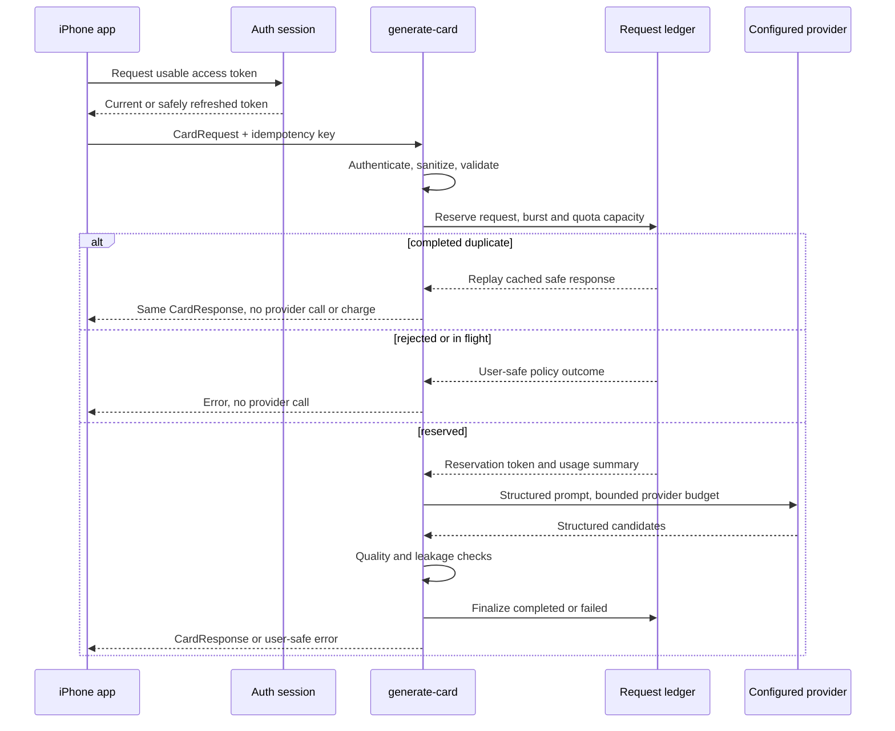

# AI Generation

ProsePal exposes two product lanes through one provider-neutral writing service.
The UI asks for a draft; routing and transport details remain below that
boundary.

## Lanes

| Lane | Use | Implementation |
|---|---|---|
| Private Draft | Everyday writing where the device model is available | Apple Foundation Models on device |
| Take More Care | Sensitive or higher-stakes writing and eligible fallback | ProsePal `generate-card` gateway |

Take More Care is not a subscription gate. Premium controls paid limits and
future extras, not whether a hard moment receives careful treatment.

## Routing

```text
MomentInput
  -> safety/refusal gate
  -> routing decision
     -> preferred private lane
     -> preferred careful lane
  -> eligible typed failure may fall back
  -> content block never falls through
```

Timeouts, offline state, usage limits, rate limits, malformed responses, and
provider refusals map into `GenerationError`. Views receive stable product
errors rather than provider-specific exceptions.

## Gateway request lifecycle



The provider call begins only after the database reservation succeeds. A failed
provider or quality attempt does not consume user usage. A successful finalize
consumes usage once.

## Idempotency and ambiguous retries

The ledger uses `(subject, idempotency_key)` uniqueness plus a SHA-256 request
fingerprint. Reusing a key with changed provider-affecting input is rejected.
A per-attempt reservation token prevents a late result from completing a lease
that has already been reclaimed.

For an initial careful draft, the app persists a pending request key and a
non-content request identity for up to 24 hours. An unchanged retry after a lost
response or relaunch can replay the completed response without a second provider
call or charge. An explicit replay-expired or conflict response clears the key
and requires another user action before a replacement request.

## Gateway validation

The Edge Function:

- verifies authenticated JWTs through Supabase Auth;
- permits anonymous development only when both the explicit development flag
  and configured development secret are present;
- caps and sanitizes every input field;
- enforces supported contract and lane versions;
- reserves burst and quota capacity atomically;
- uses a bounded provider request with configured fallbacks;
- requires three distinct structured messages;
- rejects generic filler, provider leakage, and sensitive-occasion failures;
- logs metadata only; and
- finalizes usage only after output passes quality checks.

## Retention

- Completed replay payload: 24 hours.
- Terminal or abandoned request metadata: 7 days.
- Sliding-window rate-attempt rows: 1 hour.
- Native pending initial-draft key: up to 24 hours.

Sensitive replay payloads are service-role-only and removed by an hourly
`pg_cron` cleanup job. Full request keys, fingerprints, prompts, and generated
messages are never written to operational logs.

## Contracts

`CardRequest` and `CardResponse` are defined in
`prosepal-ios/Sources/ProsePalDomain/CardModels.swift`. Current requests carry
prompt and output contract versions, a requested lane, client metadata, an
idempotency key, and a sanitized `CardIntent`.

## Verification

```bash
deno check supabase/functions/**/*.ts
deno test --allow-env supabase/functions/generate-card/index.test.ts
supabase test db
./scripts/test_gateway_ledger_concurrency.sh
```

See [Staging](../operations/staging.md) before any remote proof. The longer
pre-implementation strategy is preserved in
[AI Gateway Strategy 2026](../history/architecture/ai-gateway-strategy-2026.md).
