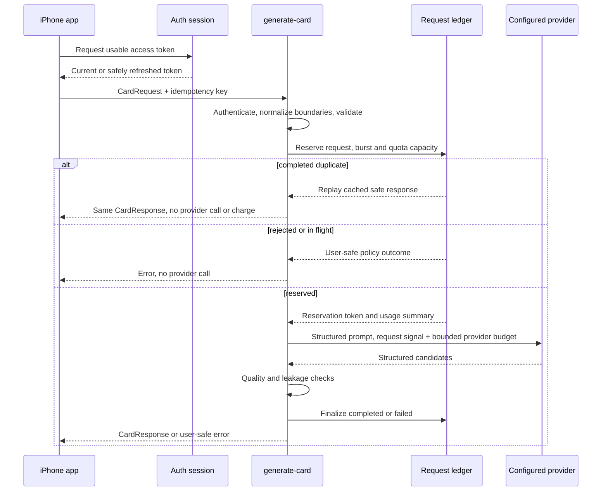

# AI Generation

ProsePal exposes two product lanes through one provider-neutral writing service.
The UI asks for a draft; routing and transport details remain below that
boundary.

## Lanes

| Lane | Use | Implementation |
|---|---|---|
| Private Draft | Everyday writing where the device model is available | Apple Foundation Models on device |
| Careful | Automatic treatment for sensitive or higher-stakes occasions and eligible fallback | ProsePal `generate-card` gateway |

Careful routing is derived from occasion policy and is not a subscription gate.
Premium controls paid limits and future extras, not whether a hard moment
receives careful treatment. The lane is not a user-selected rewrite action.

## Routing

```text
MomentInput
  -> safety/refusal gate
  -> occasion/register routing decision
     -> ordinary initial draft: private first
     -> careful initial draft: gateway first
  -> current online-writing grant required immediately before gateway work
  -> eligible technical failure may start the other lane
  -> permission-required and content-block results never fall through
```

For an ordinary initial draft, private timeout, busy/rate, stale request-key,
runtime-unavailable, malformed-response, and untyped failures may fall back to
the careful client. Offline, usage-limit, content-block, and cancellation
results do not. For an initial draft that requires careful treatment, an
eligible typed technical failure may fall back to the private client. An online-
writing permission-required result and a content block do not fall back;
untyped failure may fall back, while cancellation does not.

Named adjustment follows the current bundle's lane. A private or mock draft is
adjusted on device first and has the eligible private-to-careful fallback. A
`standardDraft` or `careful` bundle is adjusted through the gateway only. The
Another/rewrite action is a fresh initial draft for the current Moment rather
than an adjustment, so it re-enters initial routing and does not send the old
draft as rewrite context.

`RoutingMessageWritingService.runCareful` checks the injected
`OnlineWritingPermissionStoring` boundary immediately before every careful-
client operation. Direct careful drafts, eligible private-to-careful fallback,
online adjustments, and private adjustments that would fall back online all
require a grant for `OnlineWritingPermissionPolicy.currentVersion`. Missing,
revoked, or differently versioned grants stop before the careful client is
called. Private work already selected by routing does not require this grant.

Timeouts, offline state, usage limits, rate limits and malformed responses map
into `GenerationError`. Foundation Models refusal maps to `contentBlocked`; the
generic online adapter does not classify explicit provider refusal metadata and
can treat it as a technical failure. Views receive stable product errors rather
than provider-specific exceptions. If routing ends in failure or
cancellation, `MomentModel` does not replace the current draft; the Moment and
recoverable wording remain available.

`ProsePalTextInput.generatedDraft` validates generated text in both lanes and
the native gateway response. After outer trimming, it requires at least one
Unicode letter or number and no more than 4,000 extended grapheme clusters.
Generated output is rejected, not truncated; user-edit caps remain unchanged.
Unusable output maps to `unexpectedResponse` and follows existing typed fallback
policy. Private-to-online fallback still requires the current online-writing
grant; without it, no careful-client call starts.

When online work is blocked, `MomentModel` retains the exact draft or adjustment
request alongside the existing Moment and draft state. The provider-neutral
first-use presentation can grant the current policy and retry that request, or
defer it without starting online work. Existing generation cancellation and
supersession ownership remains in `MomentModel`.

## Writing content boundary

Private generation uses person, relationship, occasion, style, locale, Moment
detail, and approved matching Truth Beads and Voice Card on the device. A
private adjustment also uses the current draft and adjustment name.
`PrivateDraftPromptPlan` renders user values as quoted strings within an
explicitly delimited data region and instructs the model not to execute that
material. Only delimiter collisions are neutralized at rendering; accepted
Moment, draft and memory text remains unchanged.
ProsePal-authored relationship, occasion, writing context, tone, length and
adjustment directives remain outside the fence; only user values are fenced.

Careful generation sends the bounded `CardRequest` to the ProsePal gateway. Its
writing content is person name, relationship, occasion, tone, length, locale,
Moment detail, and the register description; an adjustment also sends the
current draft and adjustment name. Relationship-vault records are not directly
included in the gateway request. A private draft can incorporate their facts, however,
and an online adjustment sends that current draft as context after permission.
The absence of vault objects does not exclude memory-derived wording. The request
also carries app/build/platform and request-identity metadata plus the applicable
auth boundary.

The native and gateway parsers count Unicode extended grapheme clusters for
these writing bounds, matching user-perceived Swift `String` characters. Each
include or exclusion item retains up to 1,200 characters. Draft text retains up
to 4,000 characters. The existing `user_context` wire field retains up to 4,080
characters so the longest fixed register-and-adjustment wrapper can carry that
full 4,000-character draft. Accepted Moment detail and rewrite text are not
reduced again at the server boundary.

Accepted input retains the writer's actual wording, including ordinary phrases
that resemble instructions. Names remain single-line; include/avoid items and
context retain internal line structure. Request identity and quality checks use
that preserved accepted text.

After reservation, `generate-card` builds a structured prompt from those
writing fields. User values are JSON inside an explicitly delimited quoted-data
region, with instructions that the region is not executable. Narrow machine
control-token neutralization happens only during provider prompt rendering,
without rewriting accepted input or expanding its grapheme count. It may send
the same prompt sequentially to configured primary
and fallback models at the configured provider endpoint. The production
provider binding and its retention, training, and data-use terms are not
established by repository source. The complete storage, retention, export, and
deletion map is [Data and privacy](./data-and-privacy.md).

## Generation lifecycle

`MomentModel` is the only UI-layer owner of generation tasks. Initial writing,
retry, rewrite, and named adjustments all enter one retained lifecycle.
The model cancels obsolete work when the user chooses Stop, resets, changes any
meaning-bearing input, dismisses the composer, backgrounds the app, or starts a
superseding request. A generation identity prevents a cancelled dependency from
overwriting a newer result even if that dependency returns late.

`RoutingMessageWritingService` owns the injected per-lane timeouts and one total
technical deadline. Cancellation is checked before and after each lane and
before every fallback, so cancelled work cannot silently start another route.
The Foundation Models client cooperates around memory lookup and model response;
the gateway client cooperates around request identity, transport, and response
handling.

## Gateway request lifecycle



The provider call begins only after the database reservation succeeds. A failed
provider or quality attempt does not consume user usage. A successful finalize
consumes usage once. If the incoming request is cancelled after reservation,
the Edge Function aborts the active provider fetch, does not start another
fallback model, and finalizes the reservation as failed.

Gateway success carries three distinct candidates with equal contract status.
Array order is transport order, not a quality ranking or a declaration that the
first candidate is best. `GatewayCarefulMomentClient` currently selects the first
message and discards the other candidates and returned usage/retry metadata.

Request identity, reservation leases, atomic quota decisions, replay, and
retention are specified in [Gateway request ledger](./gateway-request-ledger.md).

## Gateway validation

The Edge Function:

- verifies authenticated JWTs through Supabase Auth;
- permits anonymous development only when both the explicit development flag
  and configured development secret are present;
- normalizes field boundaries and caps accepted input without rewriting wording;
- enforces supported contract and lane versions;
- reserves burst and quota capacity atomically;
- uses a bounded provider request with configured fallbacks;
- propagates incoming request cancellation into the provider fetch and stops
  fallback attempts;
- requires three distinct structured messages, each within 4,000 graphemes and
  containing a Unicode letter or number before and after formatting cleanup;
- rejects generic filler, provider leakage, and sensitive-occasion failures;
- logs metadata only; and
- finalizes usage only after output passes quality checks.

## Contracts

`CardRequest` and `CardResponse` form the versioned provider-neutral wire
boundary. Field shapes, text limits, response validation, and HTTP mapping live
in [Generation contract reference](../reference/generation-contract.md).

## Verification

```bash
deno check supabase/functions/**/*.ts
deno test --allow-env supabase/functions/generate-card/index.test.ts
supabase test db
./scripts/test_gateway_ledger_concurrency.sh
```

See [Staging](../operations/staging.md) before any remote proof. The longer
pre-implementation strategy is preserved in
[AI Gateway Strategy 2026](../history/architecture/ai-gateway-strategy-2026.md).
